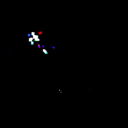

# Particle system made in pure armv8

*Made for Computer Organization class*

- The main implementation is located in [`app.s`](app.s)
- Screen size is 512x512 with 16 bit RGB pixel colors.
- `X0` register points to the frame buffer base (first pixel)
- [`main.s`](main.s) contains the frame buffer and particle memory initialization, and branchs to `app.s`
- Use `dashboard memory watch 0x40080100 256` in a armv8 qemu instance while running to look at the frame buffer
